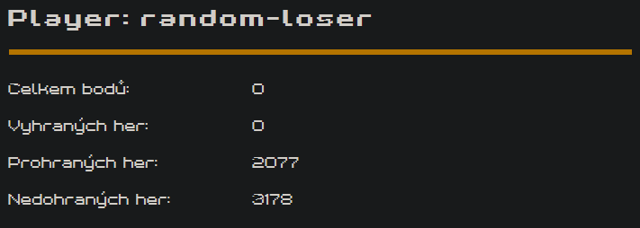

# Overview

This project is our attempt to play game provided by jobs.cz, where people are challenged to create Five in a row bots, which compete against each other using their API.  
Well, since simply applying minimax is kinda boring and every other bot does it, we applied pure randomness and we hope that in couple thousands matches we will strike at least one victory.

[Five in a row API docs](https://piskvorky.jobs.cz/api/doc)

# Setup project

- Install express-generator if you do not already have it  
`npm install -g express-generator`
- Generate default project  
`express`
- Add required deps  
`npm install --save axios cookie-session body-parser`
- **If you clone this repository, run only this command.**  
Install modules  
`npm install`

# Running app

- Start app  
`npm start`
- Open http://localhost:3000/admin

# Playing game

- Navigate to http://localhost:3000/register and register your bot
- Navigate to http://localhost:3000/play where you can either:
  - Start game manually, check status manually and play your move manually
  - Let bot start new game every 5 seconds and play random field around last played move.

# Results

Sadly, even in the year 2077, we have not been able to yield a single win. We would probably need a lot more tries to ever win. Or simply playing against actual bots who calculate their next moves are just too much for randomness to ever win.

